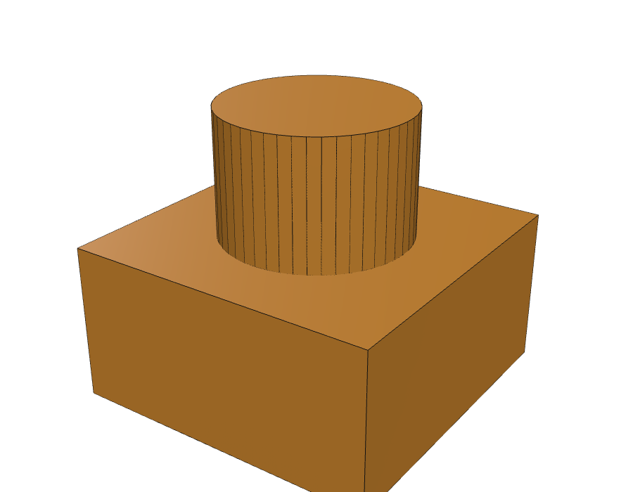
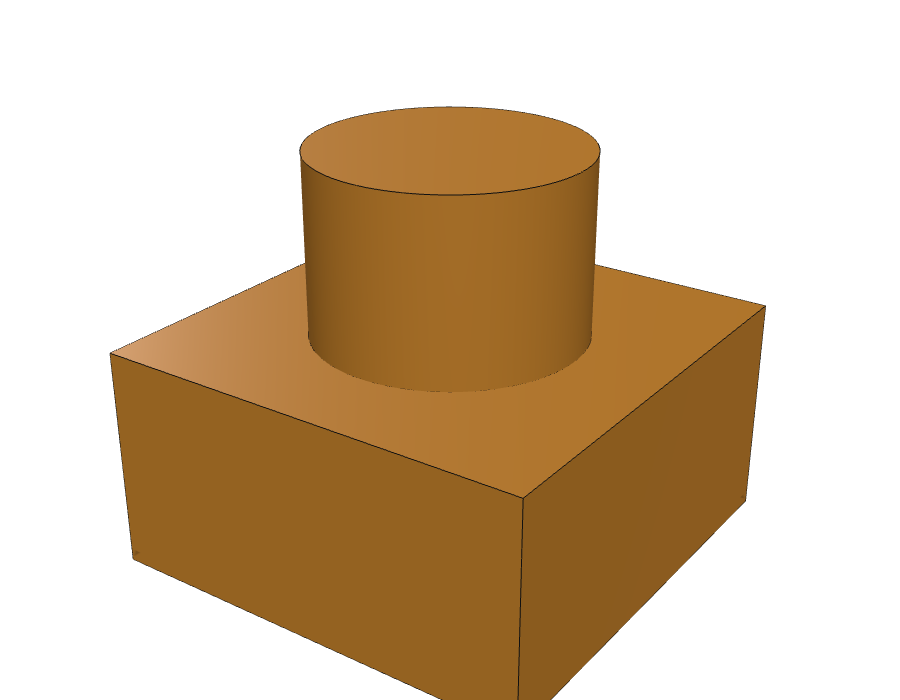
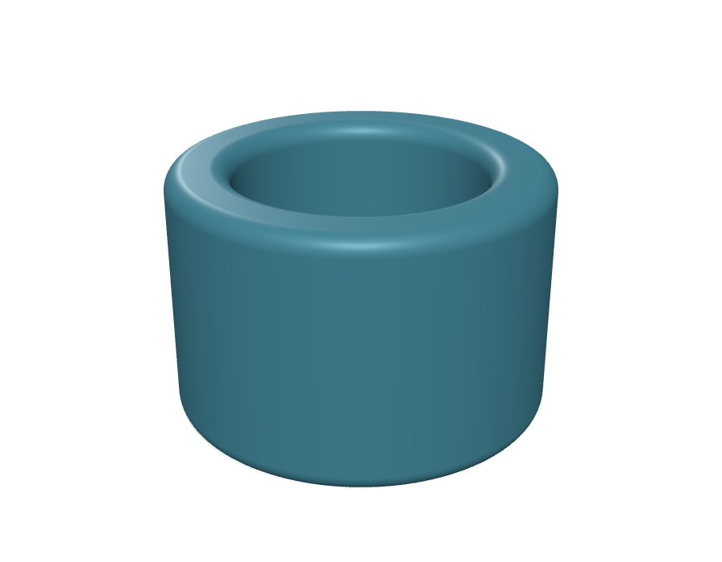
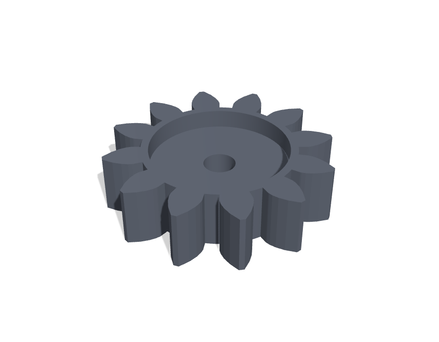
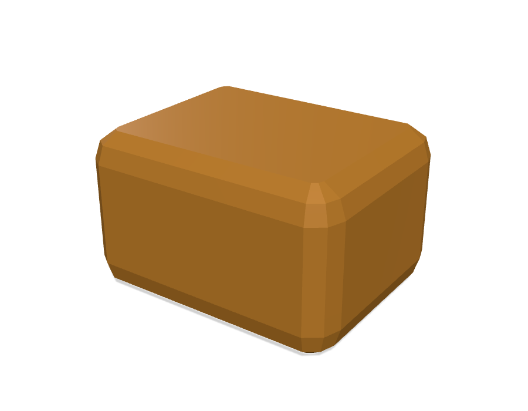
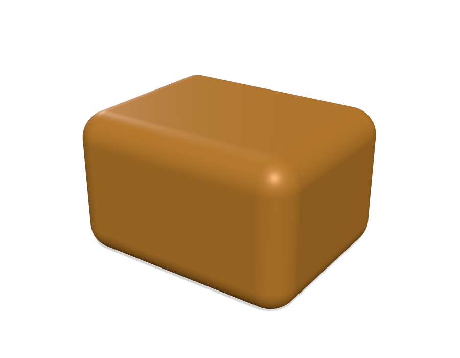
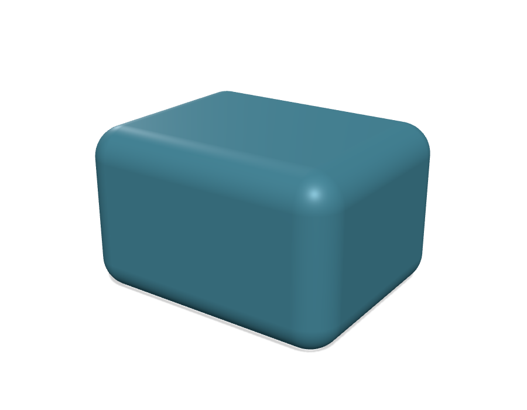
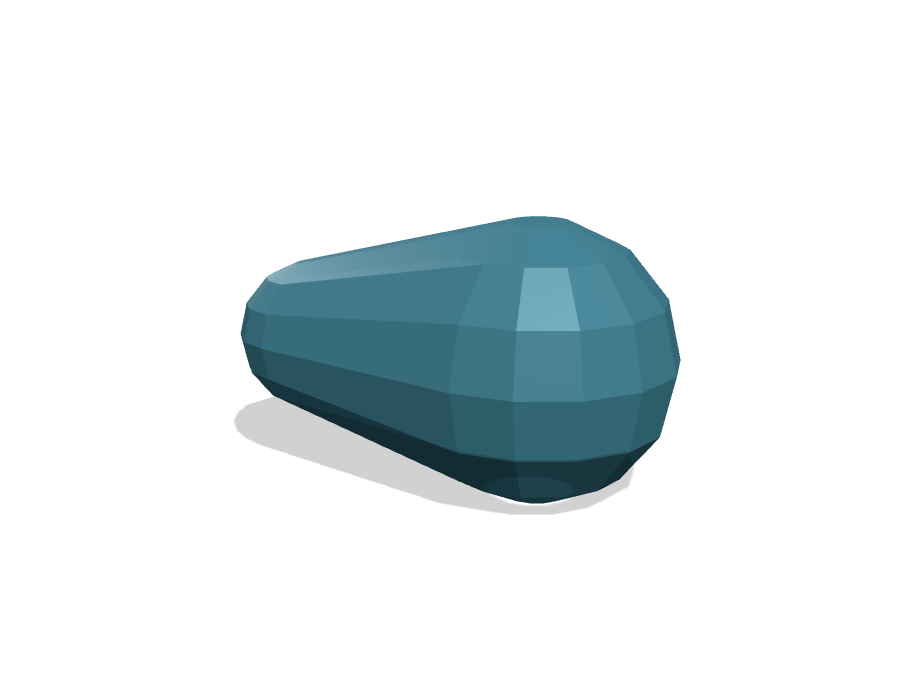

# scad123d

[](https://github.com/etjones/scad123d/actions/workflows/ci.yml)

Import an OpenSCAD design — including third-party libraries like BOSL2 and
MCAD — as real, solid geometry in [build123d](https://build123d.readthedocs.io/),
Python's native CAD kernel. Keep your existing OpenSCAD models and libraries;
get fillets, exact STEP export, and everything else that comes from working
in a solid-modeling kernel instead of a mesh renderer.

```python
import scad123d

part = scad123d.import_scad("bracket.scad")
```

That's the whole API for the common case. `part` is a normal build123d
object, so from here you're just doing build123d.

## Why this exists

OpenSCAD is a great way to describe parts in code, and there's a huge amount
of OpenSCAD out there — your own old projects, and libraries like
[BOSL2](https://github.com/BelfrySCAD/BOSL2) and
[MCAD](https://github.com/openscad/MCAD) that save you from redrawing gears,
bearings, and hardware from scratch. But OpenSCAD's own geometry engine works
by turning everything into a mesh of flat triangles — even a sphere is
secretly hundreds of tiny polygons. That's fine for previewing a design, but
it means every curve is an approximation, filleting a rounded corner just
rounds a pile of facets instead of the actual surface, and the only thing you
can export is that same triangle mesh (as an STL).

[build123d](https://github.com/gumyr/build123d) is built on OpenCASCADE, the
same kind of solid-modeling kernel used by mainstream CAD software (Fusion
360, SolidWorks, FreeCAD). Circles stay circles. A cylinder is a cylinder, not
64 flat rectangles pretending to be one — right up until you actually need a
mesh, e.g. for 3D printing.

scad123d bridges the two: it hands your `.scad` file to the real OpenSCAD
program (so every language feature, every library, works exactly as it
always has), and rebuilds the result as native build123d geometry instead of
a mesh. You get a better kernel underneath code you already have.

## What that buys you

**Real STEP export.** OpenSCAD can only export a mesh (STL). scad123d lets
you export [STEP](https://en.wikipedia.org/wiki/ISO_10303) directly from an
OpenSCAD design — the standard interchange format nearly every CAD program
reads as an actual solid body, with exact curves, not a pile of triangles
pretending to be one.

Here's the same model — a cylinder rising out of a cube — each way, with every
real edge of the shape drawn on top so the difference is easy to spot.
OpenSCAD's STL approximates the cylinder as 48 flat panels, and every one of
those panel boundaries is a real edge in the mesh:



scad123d's version has exactly the edges the shape actually has: the cube's
12 edges, the cylinder's rim, and the circle where it meets the cube. The
cylinder itself is one continuous curved face, not hundreds of triangles:



**Fillets that behave.** Round a corner on a mesh and you round the facets,
not the surface — you get a many-sided lump, not a smooth radius. Because
scad123d keeps the real geometry, you can fillet and chamfer edges normally
after importing:

```python
from build123d import fillet, Axis

part = scad123d.import_scad("bracket.scad")
part = fillet(part.edges().group_by(Axis.Z)[-1], radius=2)
```

Here's a [BOSL2](https://github.com/BelfrySCAD/BOSL2) `tube()` imported and
then filleted — a smooth, continuous rounded rim, instead of a faceted approximation
of one:



**No lost precision.** Nothing gets tessellated until you ask for a mesh
(e.g. exporting an STL for printing). Curves stay curves through as many
operations as you throw at them.

**It mixes freely with regular build123d code.** The imported part is a plain
`Shape` — select faces on it, boolean it against something you built natively
in build123d, sweep along one of its edges. 

## Installing

```bash
pip install scad123d
```

or

```bash
uv add scad123d
```

You also need the [OpenSCAD](https://openscad.org/downloads.html) program
itself installed — scad123d asks the real OpenSCAD to evaluate your file
(so every language feature and every library works), then converts the
result. It looks for OpenSCAD on your `$PATH` and in the usual install
locations automatically. If your OpenSCAD executable lives somewhere else, 
set `$SCAD123D_OPENSCAD` to point at it directly.

## Using libraries: BOSL2 and MCAD

Because scad123d hands your file to the real OpenSCAD, `include`/`use`
statements work exactly as they do when you run OpenSCAD directly — install a
library the normal OpenSCAD way (in your
[OpenSCAD library folder](https://en.wikibooks.org/wiki/OpenSCAD_User_Manual/Libraries),
or alongside your project) and `include`/`use` it like always.

A gear from [MCAD](https://github.com/openscad/MCAD):

```python
# gear.scad:
#   use <MCAD/involute_gears.scad>
#   gear(number_of_teeth=12, circular_pitch=8, gear_thickness=6, bore_diameter=5);

gear = scad123d.import_scad("gear.scad")
```



A rounded box from BOSL2:

```python
# box.scad:
#   include <BOSL2/std.scad>
#   cuboid([20, 15, 10], rounding=3);

box = scad123d.import_scad("box.scad")
```

You can also pass values into top-level variables in the `.scad` file, the
same way OpenSCAD's `-D` flag does:

```python
part = scad123d.import_scad("bracket.scad", width=40, holes=6)
```

## Where this shines: rounding with `minkowski()`

Rounding a shape with `minkowski()` (summing it with a small sphere) is
one of the most common things people do in OpenSCAD. OpenSCAD computes it by
meshing everything and finding the sum numerically — the rounded corners come
out as a cluster of small flat facets, not a true curve.

scad123d recognizes this specific, very common pattern and computes it
directly as an exact geometric offset instead. The result isn't just cleaner —
it's **more accurate than OpenSCAD's own answer**, and it stays a real curved
surface you can select and fillet further, rather than an approximation
that's baked in for good. It's often several times faster, too.

Same `minkowski()` call, OpenSCAD's own result on the left, scad123d's on the
right:

<p>


</p>

This covers the overwhelming majority of real-world `minkowski()` calls,
since rounding a shape is what most people use it for.

## Where this breaks down: `hull()`

`hull()` doesn't have as clean an answer. scad123d computes a few common,
recognizable patterns exactly — most usefully, the classic "rounded box built
from spheres at each corner" idiom:

```openscad
hull() {
    translate([-10,-7.5,-5]) sphere(r=3);
    translate([ 10,-7.5,-5]) sphere(r=3);
    // ...6 more corners
}
```



But `hull()` in general — arbitrary shapes, spheres of different sizes,
whatever else OpenSCAD lets you throw into it — has no equivalent operation
in build123d's kernel at all. When scad123d can't compute an exact answer, it
doesn't fail: it asks the real OpenSCAD program to render just that piece as
a mesh and stitches the result in. Your model still imports and still comes
out correct — you just lose the "real curved surface" benefits (fillets,
exact export) for that specific piece:

```openscad
hull() {
    translate([-8, 0, 0]) sphere(r=5);
    translate([ 8, 0, 0]) sphere(r=9);   // different radius -- no exact answer
}
```



**scad123d never refuses to import something** — it just tells you, with a
warning naming the exact operation, whenever a piece of your model had to
fall back to a mesh instead of staying exact. See
[docs/REFERENCE.md](docs/REFERENCE.md) for the full, precise list of what's
covered and what isn't, if you want to know exactly where a particular model
will land.

## A few other things to know

- **Cylinders and circles you deliberately made low-poly** (a hexagon nut, a
  6-sided bolt head) are preserved as the actual polygon you asked for — not
  smoothed out into a circle. This is a heuristic based on how many sides you
  asked for, and it's [configurable](docs/REFERENCE.md#fn-fa-fs) if it ever
  guesses wrong.
- A few less-common OpenSCAD features — `projection()`, `surface()`,
  importing a mesh file with `import()`, `linear_extrude(twist=...)` — always
  take the mesh-fallback path for now. Everything else works normally.
- **Only import files you trust.** scad123d runs the real OpenSCAD interpreter
  on your file, and OpenSCAD can `include` other files or read arbitrary paths
  from disk — the same way running any script you didn't write is a risk.
  Don't point this at a `.scad` file from someone you don't trust.

## Development

```bash
just test      # everything
just test-ci   # only tiers that need no OpenSCAD binary
just fixtures  # regenerate committed .csg fixtures + reference metrics
```

See [docs/REFERENCE.md](docs/REFERENCE.md) for exactly how the import works
and the precise behavior of every option, and [ROADMAP.md](ROADMAP.md) for
what's planned next.

## License

MIT
